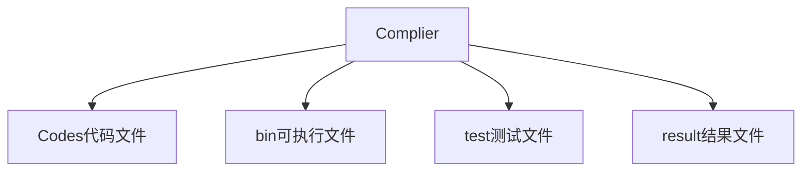
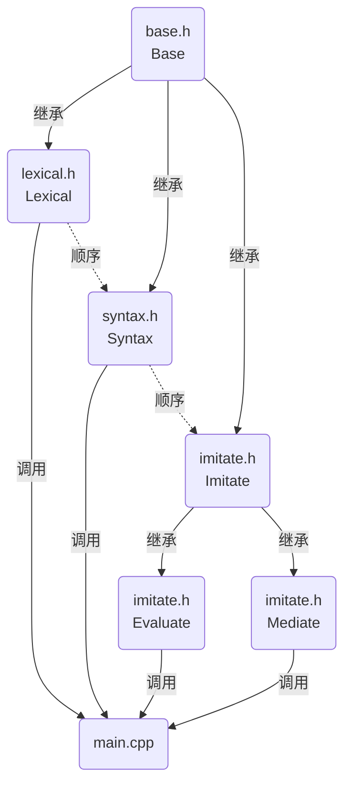

- Recently modified on 2023/11/28 by Slc

## 项目结构

```mermaid
    graph TB
    Complier --> Codes代码文件
    Complier --> bin可执行文件
    Complier --> test测试文件
    Complier --> result结果文件
```

## 代码部分结构

```mermaid
    graph TB
    基类(base.h
    Base) --继承--> 词法分析(lexical.h
Lexical)
    基类 --继承--> 语法分析(syntax.h
Syntax)
    基类 --继承--> 模拟扫描(imitate.h
Imitate)
    模拟扫描 --继承--> show展示(imitate.h
Evaluate)
    模拟扫描 --继承--> 中间代码生成(imitate.h
Mediate)
    词法分析 --调用--> 主函数(main.cpp)
    语法分析 --调用--> 主函数
    show展示 --调用--> 主函数
    中间代码生成 --调用--> 主函数

    词法分析 -.顺序.-> 语法分析
    语法分析 -.顺序.-> 模拟扫描
```

## 开始
在main.cpp里依次执行词法分析、语法分析、show函数结果展示、中间代码生成的步骤。  
结果输出路径可在main.cpp里设置，日志输出路径可在base.h里设置。